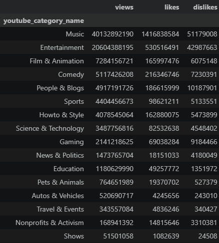
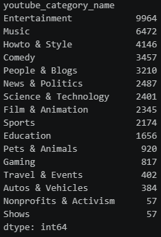
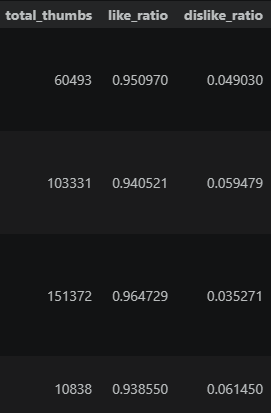
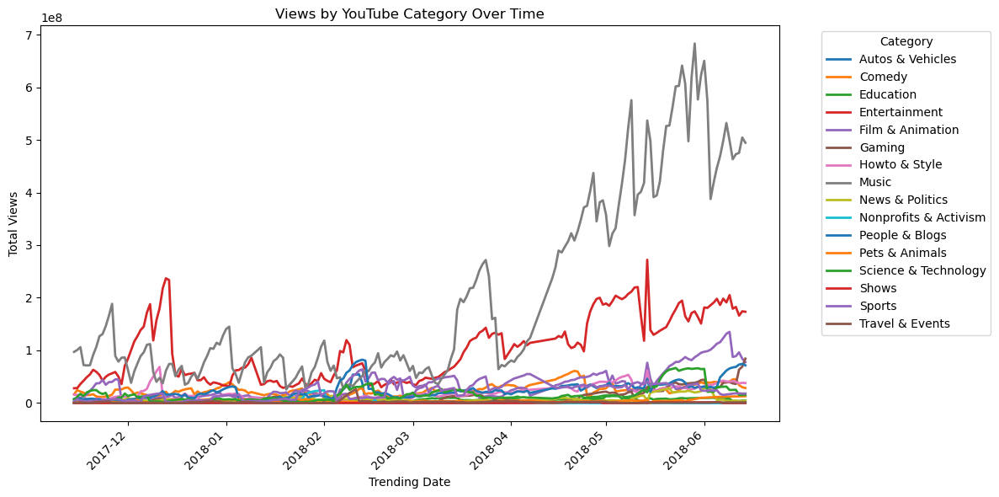
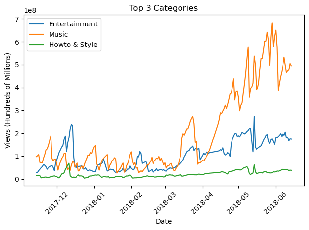
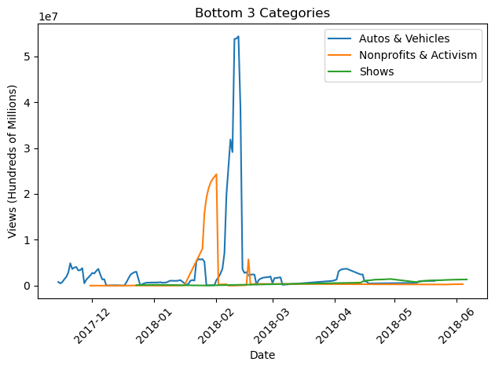
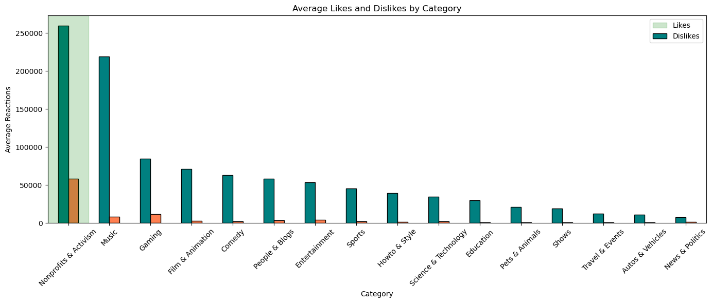
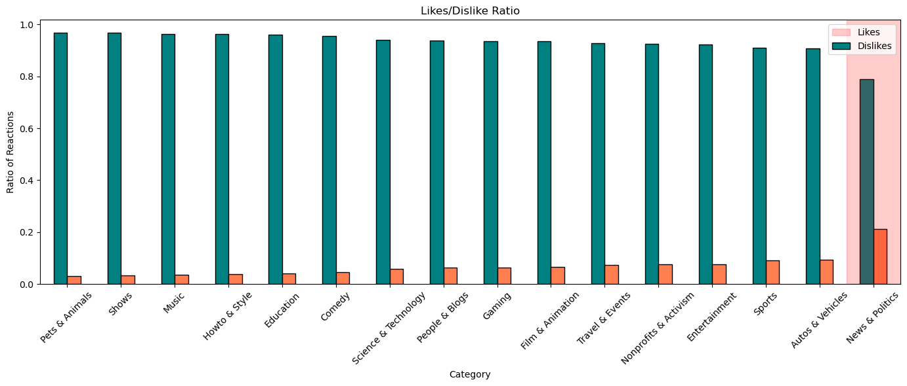
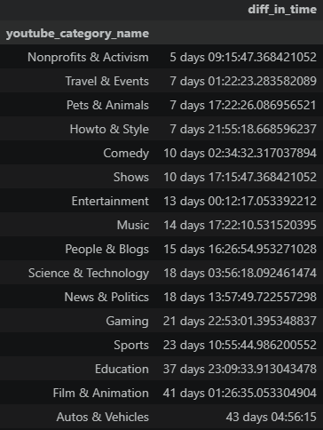
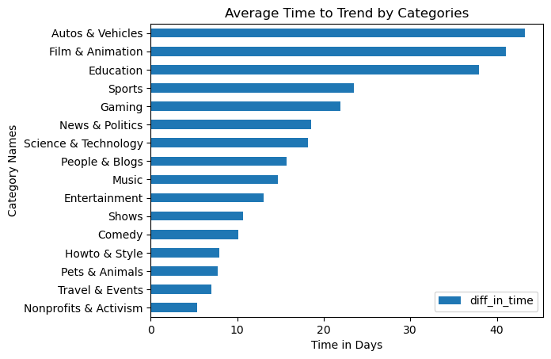

# READ ME

## Project Goals
### This case study explores the viewing trends on YouTube videos in different countries and the impact of audience engagement and popularity. 

Some of the questions we plan to answer:
- What is the most trending category at a certain point in time?
- Do certain categories being out lead to certain categories being in?
- How does engagement or controversy drive views?
- What categories trend the fastest?

### This knowledge will help content creators optomize their videos towards their goals. It will help marketing teams understand audience behavior.


## The Dataset
### The dataset contains information on viewer activity in different countries. Columns we are working with include: trending date, publish time, likes, dislikes, category, and tags (?). The data is relatively clean and not missing large portions of the information. The features relate different points of interest about how often videos are viewed and how polarized or neutral the content was perceived to be by the viewer. 

## Analysis Overview

**Motivation**
Taking Youtube datasets to help inform content creators on what categories are currently trending and their historical rises and falls. Looks at controversy by comparing the ratio between likes and dislikes amongst categories to highlight which subjects may face more or less resistance.

**Summary of Findings**
`Entertainment` and `Music` typically highest in terms of views. If content creators works don't fall in these two categories, a different presentation medium may be warranted. If content can be packaged into the top categories, viewership may increase. `Nonprofits & Activism` and `News & Politics` were very controversial topics and created a lot of engagement and/or trended very quickly.

___

# Data Analysis

### Running Preliminary Analysis
After project set up, we ran a preliminary analysis to get an idea of what the data looked like.

```
us_df = pd.read_csv("USvideos.csv")
us_df.info()
```

```
us_df.head()
```

```
us_df.sample(5)
```

```
us_df.shape
```

All columns had values, minus the description column. The data contained various types of data, including objects, integers, strings, and booleans. In our analysis, we mainly looked at string and integer values.

There were duplicates found in the data, but we did not drop the duplicates.

### Formatting & Categorizing the Data

The data contained a `category_id` parameter, where each of the category IDs were mapped to a specific category of video. We created a dictionary to map each of these integer values to a string value and put it into a new column.

```
youtube_categories = {
    1: "Film & Animation",
    2: "Autos & Vehicles",
    10: "Music",
    15: "Pets & Animals",
    17: "Sports",
    18: "Short Movies",
    19: "Travel & Events",
    20: "Gaming",
    21: "Videoblogging",
    22: "People & Blogs",
    23: "Comedy",
    24: "Entertainment",
    25: "News & Politics",
    26: "Howto & Style",
    27: "Education",
    28: "Science & Technology",
    29: "Nonprofits & Activism",
    30: "Movies",
    31: "Anime/Animation",
    32: "Action/Adventure",
    33: "Classics",
    34: "Comedy",
    35: "Documentary",
    36: "Drama",
    37: "Family",
    38: "Foreign",
    39: "Horror",
    40: "Sci-Fi/Fantasy",
    41: "Thriller",
    42: "Shorts",
    43: "Shows",
    44: "Trailers"
}

us_df["youtube_category_name"] = us_df["category_id"].map(youtube_categories)
```

Some of the data values were not consistent across the data. We converted the columns including any sort of date, such as `trending_date` and `publish_time` to datetime values to make them easier to compare.

```
us_df['trending_date']=pd.to_datetime(us_df['trending_date'], format="%y.%d.%m")
```

Getting a quick overview of the top categories.

```
us_df.groupby("youtube_category_name")[["views", "likes", "dislikes"]].sum().sort_values("views", ascending=False)
```



We also categorized the data by the video category to get information on trends based on the categories.

```
views_category= us_df.groupby('youtube_category_name').size().sort_values(ascending=False)
```




### Visualizing Engagement in Videos

We wanted to visualize the patterns of engagement across YouTube videos, using the ratio of likes to dislikes as a metric for how liked/hated a video was. First we got the value of all people who left a like or dislike.

```
us_df["total_thumbs"]= us_df['likes'] + us_df['dislikes']
```

Then we got each of the ratios of likes vs. dislikes compared to the total amount of likes and dislikes.

```
us_df['like_ratio']= us_df["likes"] / us_df["total_thumbs"]
us_df['dislike_ratio']= us_df["dislikes"] / us_df["total_thumbs"]
```
Example.


We also got a metric for how many people viewed the video, but did not leave a like or dislike.

```
us_df["view_to_rate_prop"] = (((us_df["views"] - (us_df["likes"] + us_df["dislikes"])) / us_df["views"]))
```

Next, we created some visualizations for the data. First, we got an overview of views by category over the time. Unfortunately, our data only covered about a half year's worth of time, so we could not make valid conclusions on some of the yearly and seasonal trends.

```
category_views = (
    us_df.groupby(["trending_date", "youtube_category_name"])["views"]
    .sum()
    .unstack(fill_value=0)
    .sort_index()
)

category_views.plot(
    kind="line",
    figsize=(12, 6),
    linewidth=2
)

plt.title("Views by YouTube Category Over Time")
plt.xlabel("Trending Date")
plt.ylabel("Total Views")
plt.xticks(rotation=45)
plt.legend(title="Category", bbox_to_anchor=(1.05, 1), loc="upper left")
plt.tight_layout()
plt.show()
```



Most of the data was found to be linear, except for two categories: Music and Entertainment.

From this finding, we wanted to dig deeper into the top and bottom categories to see their trends in a more clear graph. We graphed both the top 3 and the bottom 3 to discover more.





We could assume that the top 2 categories spiked during the summertime, but no valid conclusion can be made because of the lack of data across the year. The bottom 3 showed us some interesting peaks of traffic.

Next, we wanted to visualize our measure of engagement: likes vs. dislikes. First, we created a graph to visualize the total amounts of likes and dislikes across all video categories. These are not the ratios, just the raw numbers.

```
category_reactions = (
    us_df.groupby("youtube_category_name")[["likes", "dislikes"]].mean().sort_values("likes", ascending=False)
)

category_reactions.plot(
    kind="bar",
    figsize=(14,6),
    color=["teal", "coral"],
    edgecolor="black"
)

plt.title("Average Likes and Dislikes by Category")
plt.xlabel("Category")
plt.ylabel("Average Reactions")
plt.xticks(rotation=45)
plt.axvspan(-0.5, 0.5, color='green', alpha=0.2)

plt.legend(["Likes", "Dislikes"])

plt.tight_layout()
plt.show()
```



The `Nonprofits & Activism` category had a significantly larger amount of engagement, both in likes and dislikes. This category notably had much more dislikes that every other category. The `Music` category also has a large amount of engagement. These values are not based on any count of views or number of vides, so it was interesting to see that categories with a smaller amount of videos and views show much more engagement.

Next, we got recreated the same graph using ratios of likes and dislikes instead of just raw values.

```
category_reactions = (
    us_df.groupby("youtube_category_name")[["like_ratio", "dislike_ratio"]].mean().sort_values("like_ratio", ascending=False)
)

category_reactions.plot(
    kind="bar",
    figsize=(14,6),
    color=["teal", "coral"],
    edgecolor="black"
)

plt.title("Likes/Dislike Ratio")
plt.xlabel("Category")
plt.ylabel("Ratio of Reactions")
plt.axvspan(14.5, 15.5, color='red', alpha=0.2)
plt.xticks(rotation=45)

plt.legend(["Likes", "Dislikes"])

plt.tight_layout()
plt.show()
```



Only one category stands out from this visualization: `News & Politics`. This category has a much higher amount of dislikes compared to likes, implying that people may feel more passionate about the subject, and feel the need to engage more.


### Time Until Trending

Another value that we looked into was the `trending_date`. We decided to look at how long it took until videos became "trending" and compared them across the video categories.

First, we created a new column to display the difference in time between when the video was considered "trending" and when it was published. We decided to ignore the hours and based our measurement only on days to narrow the data.

```
us_df['diff_in_time'] = pd.to_timedelta(us_df['trending_date']-us_df['publish_time'], unit='D')
```
Then we created a new dataframe to view the difference in time among each of the video categories.

```
tddf = pd.DataFrame(us_df.groupby('youtube_category_name')['diff_in_time'].mean().sort_values())
tddf['diff_in_time'] = pd.to_timedelta(tddf['diff_in_time'], unit='D')
```



```
tddf["diff_in_time"] = (tddf["diff_in_time"] / pd.Timedelta(days=1))
```
```
youtube_category_name
Nonprofits & Activism     5.385965
Travel & Events           7.057214
Pets & Animals            7.723913
Howto & Style             7.913411
Comedy                   10.107318
Shows                    10.719298
Entertainment            13.008531
Music                    14.723733
People & Blogs           15.685358
Science & Technology     18.164098
News & Politics          18.581825
Gaming                   21.953488
Sports                   23.455382
Education                37.964976
Film & Animation         41.060128
Autos & Vehicles         43.205729
Name: diff_in_time, dtype: float64
```

Finally, we plotted these values on a bar chart.

```
tddf.plot(kind='barh', xlabel='Time in Days', ylabel='Category Names', title='Average Time to Trend by Categories')
```



We found that `Nonprofits & Activism` was the quickest to trend, `Autos & Vehicles` was the slowest.


# Findings

